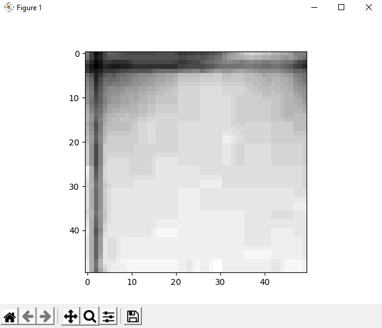

# Image-Recognition-PyTorch

**Description**

This neural network allows to distinguish two different patterns of images returning 0 or 1.

To change the pattern of the images to be recognized, it is necessary to change the images in the DataSet and retrain the neural network.

* **Pattern 0**

This image will return 0

* **Pattern 1**

This image will return 1
 
